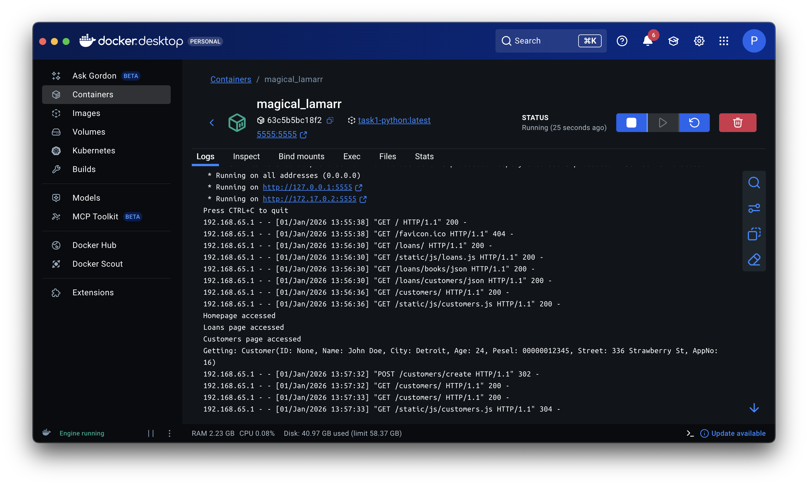
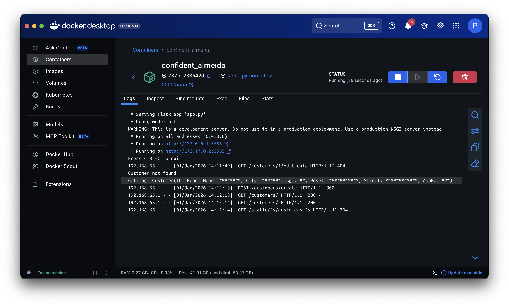

# Security By Design

## Zadanie 1

### Identyfikacja problemu
Podczas analizy logów aplikacji (moduł Python) wykryto incydent bezpieczeństwa polegający na wycieku danych osobowych.
W logach zapisywane były one w formie niezaszyfrowanej.


## Podjęte działania naprawcze
W celu wyeliminowania podatności wprowadzono mechanizm anonimizacji logów. Zmiany zostały zaimplementowane w pliku źródłowym `customers/models.py`.
 
Zastąpiono dotychczasową metodę odpowiedzialną za przygotowanie tekstowej reprezentacji danych klientów
```python
def __repr__(self):
    return f"Customer(ID: {self.id}, Name: {self.name}, City: {self.city}, Age: {self.age}, Pesel: {self.pesel}, Street: {self.street}, AppNo: {self.appNo})"

```
wersją, która anonimizuje wrażliwe informacje:
```python
def __repr__(self):
    return f"Customer(ID: {self.id}, Name: {'*'*len(self.name)}, City: {'*'*len(self.city)}, Age: {'*'*len(self.age)}, Pesel: {'*'*len(self.pesel)}, Street: {'*'*len(self.street)}, AppNo: {'*'*len(self.appNo)})"
```

## Weryfikacja
Ponowna weryfikacja logów potwierdziła skuteczność zabezpieczenia. Dane klientów nie są już zapisywane w logach aplikacji.

